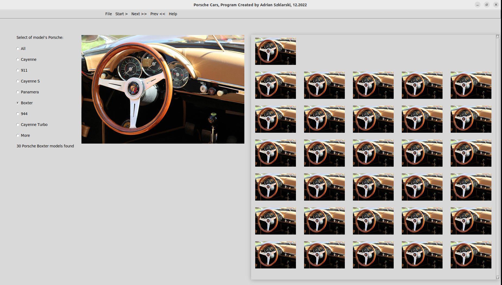

<h1 align="center">Porsche Aplication</h1>

 

An application I wrote fills in a form on olx.pl, motoring, Porsche and takes a print screen of the pages available with the cars and saves to a catalogue. 

 

First preview version of the application (in progress) 

 
<h2 align="center">Created by Adrian Szklarski, start time 12.2022</h2>
